# 🌱 Sol-Green 环保奖励平台 - 项目介绍

## 📌 项目简介

Sol-Green 是一个基于 Solana 区块链的去中心化环保行为记录与奖励平台。用户通过提交环保行为（垃圾分类、植树造林、低碳出行等）获得代币奖励，平台利用 AI 反欺诈检测、链上存证和第三方机构认证等技术确保行为真实性和可信度。

### 核心价值

- 🌍 **环保激励**：通过代币奖励激励用户参与环保行为
- 🔒 **透明可信**：所有行为记录在 Solana 区块链上，不可篡改
- 🤖 **智能审核**：AI 自动检测，低风险行为即时通过
- 🎯 **活动丰富**：挑战活动和营销活动增加参与趣味性
- 🌐 **多链支持**：支持 Solana、Ethereum、Polygon、BSC 等多条链

---

## 🎬 功能演示（按使用流程）

### 第一部分：平台入口

#### 1. 平台首页

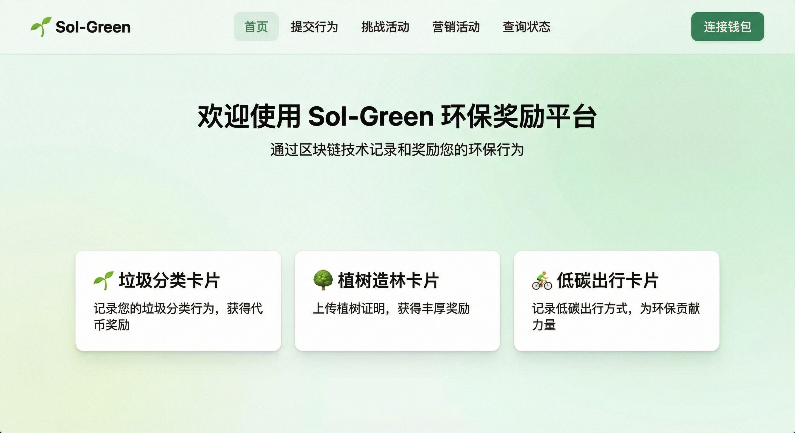

**页面说明：**
- **导航栏**：首页、提交行为、挑战活动、营销活动、查询状态
- **钱包连接入口**：右上角一键连接 Solana 钱包
- **核心功能展示**：三个功能卡片展示平台主要功能
  - 🗑️ 垃圾分类：记录垃圾分类行为，获得代币奖励
  - 🌳 植树造林：上传植树证明，获得丰厚奖励
  - 🚴 低碳出行：记录低碳出行方式，为环保贡献力量
- **设计风格**：绿色环保主题，现代化UI设计

**操作流程：**
1. 访问平台首页
2. 浏览核心功能介绍
3. 点击导航栏进入各功能模块

---

### 第二部分：基础功能

#### 2. 钱包连接

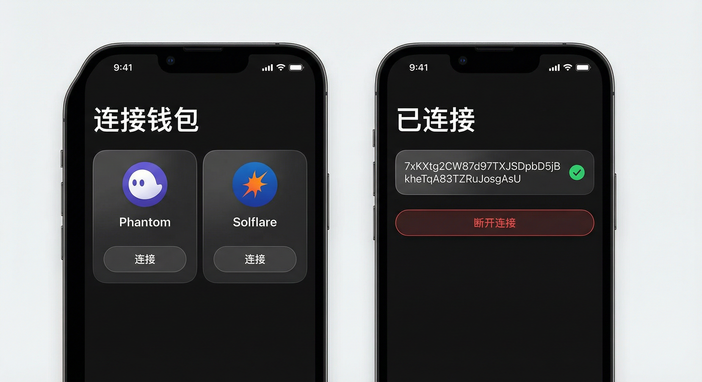

**功能说明：**
- **支持的钱包**：Phantom Wallet、Solflare Wallet
- **连接方式**：点击"连接钱包"按钮，选择钱包类型
- **安全认证**：使用钱包签名进行身份认证，无需输入私钥

**操作步骤：**
1. 点击右上角"连接钱包"按钮
2. 选择钱包类型（Phantom 或 Solflare）
3. 在钱包应用中确认连接
4. 连接成功后显示钱包地址和连接状态

**安全特性：**
- ✅ 使用钱包签名进行身份认证
- ✅ 无需输入私钥，安全可靠
- ✅ 支持自动连接功能
- ✅ 可随时断开连接

---

#### 3. 提交环保行为（主页面）

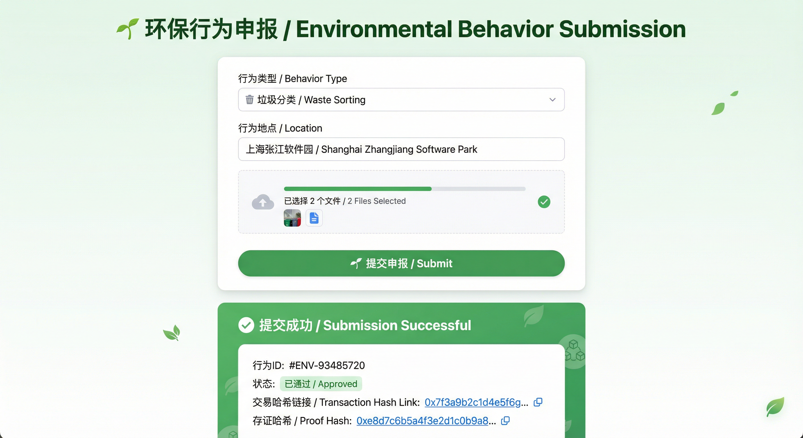

**页面说明：**
- **行为类型选择**：下拉菜单选择行为类型
- **地点输入**：可选填写行为发生地点
- **文件上传**：支持上传1-5张图片或视频作为证明
- **提交按钮**：提交申报后进入AI检测流程

**操作流程：**
1. 选择行为类型（垃圾分类/植树造林/低碳出行）
2. 填写行为地点（可选）
3. 上传证明文件（图片/视频）
4. 点击"提交申报"按钮
5. 等待AI检测和审核结果

---

#### 4. 挑战活动（主页面）

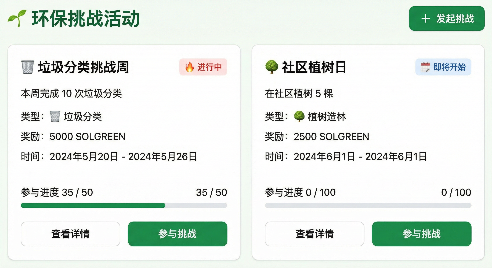

**页面说明：**
- **挑战列表**：显示所有进行中的挑战活动
- **挑战卡片**：每个挑战显示标题、描述、奖励、进度等信息
- **创建挑战**：右上角"+ 发起挑战"按钮
- **参与挑战**：点击"参与挑战"按钮加入活动

**操作流程：**
1. 浏览挑战活动列表
2. 点击"查看详情"了解挑战规则
3. 点击"参与挑战"加入活动
4. 或点击"+ 发起挑战"创建新挑战

---

#### 5. 营销活动（主页面）

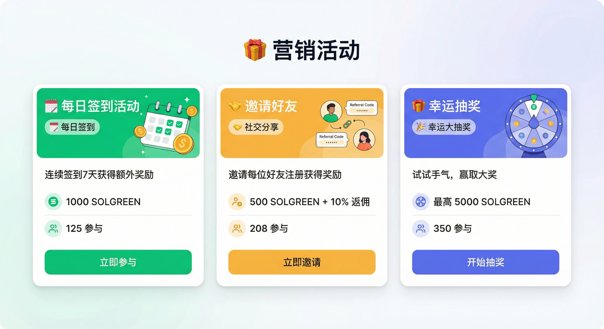

**页面说明：**
- **活动列表**：显示所有进行中的营销活动
- **活动类型**：签到、邀请、任务、抽奖、限时抢购、节日活动
- **活动卡片**：显示活动标题、描述、奖励、参与人数
- **参与按钮**：点击"立即参与"加入活动

**操作流程：**
1. 浏览营销活动列表
2. 查看活动详情和奖励规则
3. 点击"立即参与"加入活动
4. 完成活动任务获得奖励

---

#### 6. 查询行为状态（主页面）

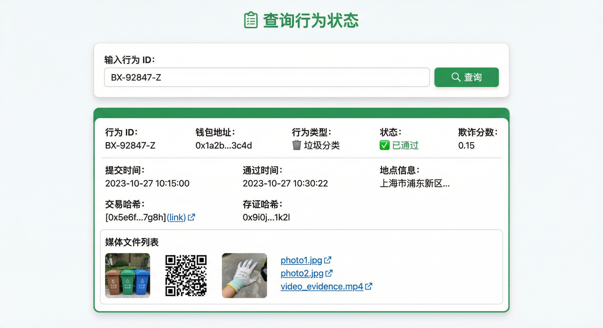

**页面说明：**
- **查询输入框**：输入行为ID进行查询
- **查询结果**：显示行为的详细状态和信息
- **状态标签**：待审核/已通过/已拒绝

**操作流程：**
1. 输入行为ID（提交后获得）
2. 点击"查询"按钮
3. 查看详细的状态信息

---

### 第三部分：具体操作详情

#### 7. 垃圾分类行为提交详情

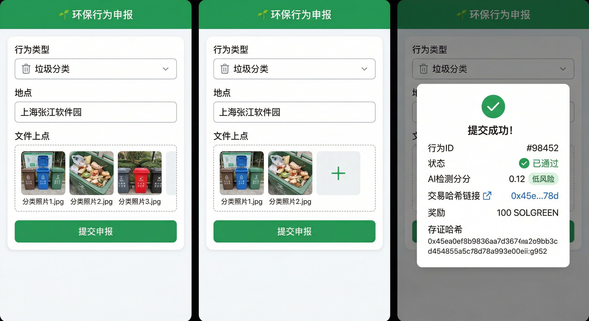

**详细操作流程：**

**步骤1：选择行为类型**
- 在下拉菜单中选择"🗑️ 垃圾分类"

**步骤2：填写信息**
- 地点：输入"上海张江软件园"（可选）
- 上传证明：选择3张垃圾分类照片

**步骤3：提交申报**
- 点击"提交申报"按钮
- 系统自动进行AI反欺诈检测

**步骤4：查看结果**
- **自动通过**（低风险）：
  - ✅ 状态：已通过
  - 📊 AI检测分数：0.12（低风险）
  - 💰 奖励：100 SOLGREEN
  - 🔗 交易哈希：可在Solana Explorer查看
  - 📝 存证哈希：行为记录已上链

**奖励机制：**
- 基础奖励：100 SOLGREEN
- 高质量照片额外奖励：+20 SOLGREEN
- 连续提交加成：+10 SOLGREEN/次

---

#### 8. 植树造林行为提交详情

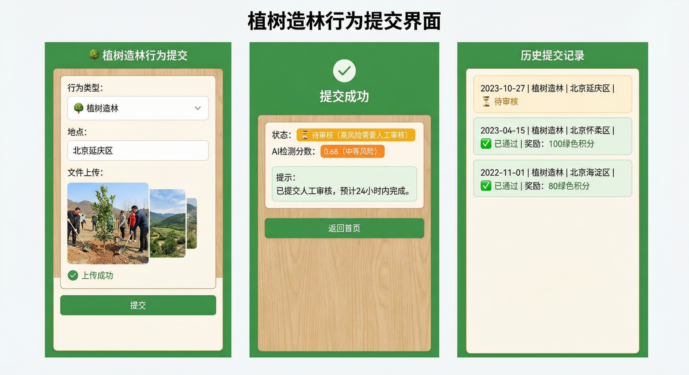

**详细操作流程：**

**步骤1：选择行为类型**
- 在下拉菜单中选择"🌳 植树造林"

**步骤2：填写信息**
- 地点：输入"北京延庆区"
- 上传证明：上传植树照片（显示树木和种植场景）

**步骤3：提交申报**
- 点击"提交申报"按钮
- AI检测分数：0.68（中等风险）

**步骤4：审核结果**
- **待审核**（高风险）：
  - ⏳ 状态：待审核
  - 📊 AI检测分数：0.68（中等风险）
  - ⏰ 提示：已提交人工审核，预计24小时内完成
  - 📋 历史记录：显示之前的植树行为记录

**审核流程说明：**
- AI检测分数 < 0.3：低风险，自动通过
- AI检测分数 0.3-0.7：中风险，人工审核
- AI检测分数 > 0.7：高风险，直接拒绝

---

#### 9. 低碳出行行为提交详情

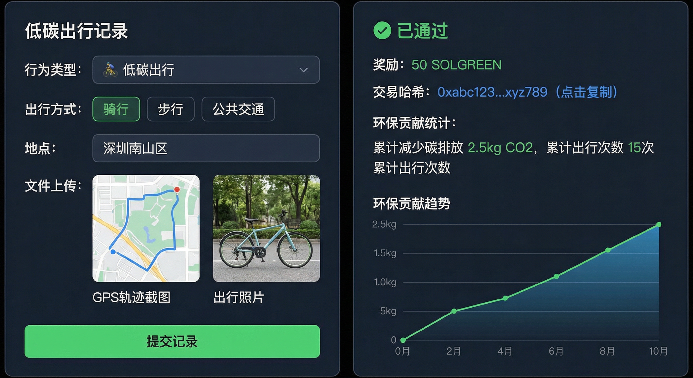

**详细操作流程：**

**步骤1：选择行为类型**
- 在下拉菜单中选择"🚴 低碳出行"

**步骤2：填写信息**
- 地点：输入"深圳南山区"
- 上传证明：上传GPS轨迹截图和出行照片

**步骤3：提交申报**
- 点击"提交申报"按钮
- 系统自动计算碳排放减少量

**步骤4：查看结果**
- **自动通过**：
  - ✅ 状态：已通过
  - 💰 奖励：50 SOLGREEN
  - 🔗 交易哈希：可在Solana Explorer查看

**环保贡献统计：**
- 📊 累计减少碳排放：2.5kg CO2
- 📈 累计出行次数：15次
- 📉 环保贡献趋势图：显示用户的环保贡献趋势

---

#### 10. 挑战活动详情页面

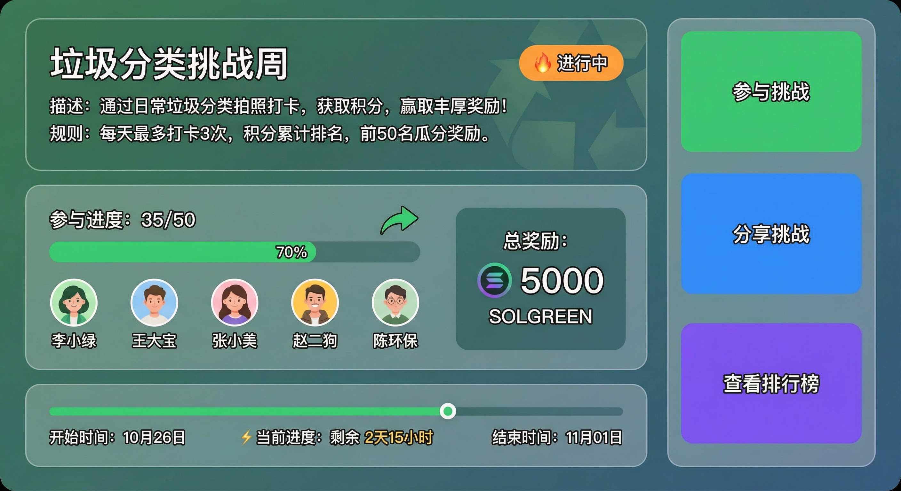

**详细操作流程：**

**步骤1：查看挑战详情**
- 点击挑战卡片上的"查看详情"按钮
- 进入挑战详情页面

**步骤2：了解挑战信息**
- **挑战标题**："垃圾分类挑战周"
- **状态标签**：🔥 进行中
- **挑战描述**：详细说明挑战内容和规则
- **挑战规则**：参与条件和奖励规则

**步骤3：查看参与进度**
- **进度条**：35/50（70%完成度）
- **参与者列表**：显示前5个参与者的头像和昵称
- **奖励池**：总奖励 5000 SOLGREEN

**步骤4：参与挑战**
- 点击"参与挑战"按钮
- 选择已审核通过的环保行为参与
- 确认参与后加入挑战

**步骤5：查看时间线**
- **开始时间**：显示挑战开始时间
- **当前进度**：实时更新参与人数
- **结束倒计时**：显示剩余时间

**其他功能：**
- 📤 分享挑战：邀请好友参与
- 🏆 查看排行榜：查看参与排名

---

#### 11. 创建挑战操作详情

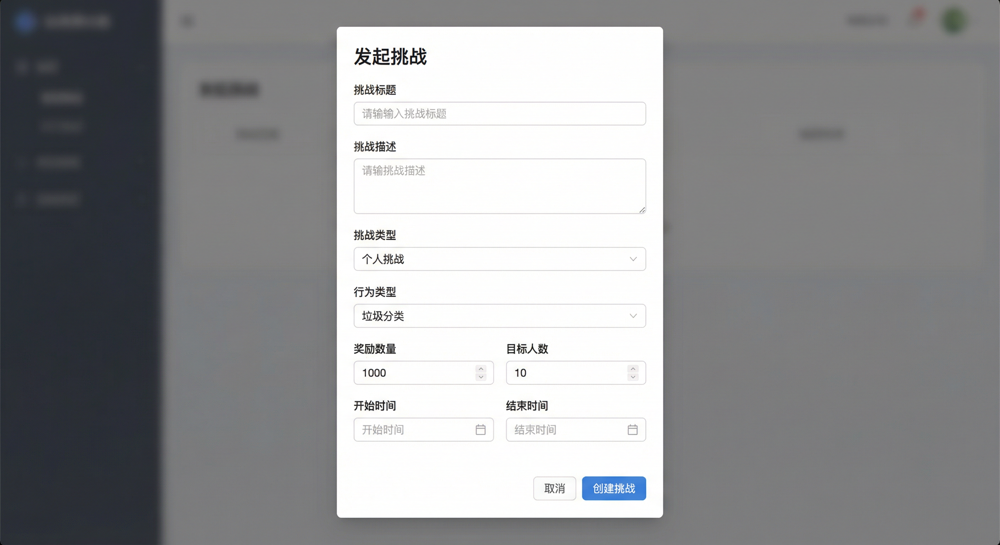

**详细操作流程：**

**步骤1：打开创建挑战模态框**
- 点击挑战活动页面右上角"+ 发起挑战"按钮
- 弹出创建挑战表单

**步骤2：填写挑战信息**
- **挑战标题**：输入"垃圾分类挑战周"（必填）
- **挑战描述**：详细描述挑战内容和目标（必填）
- **挑战类型**：选择个人/团队/社区（必填）
- **行为类型**：选择垃圾分类/植树造林/低碳出行（必填）

**步骤3：设置挑战参数**
- **奖励数量**：输入1000 SOLGREEN（必填）
- **目标人数**：输入10人（必填）
- **开始时间**：选择挑战开始时间（必填）
- **结束时间**：选择挑战结束时间（必填）

**步骤4：提交创建**
- 检查所有信息无误
- 点击"创建挑战"按钮
- 系统创建挑战并返回挑战ID

**注意事项：**
- 需要先连接钱包并登录
- 奖励金额需要足够支付
- 时间设置要合理（结束时间晚于开始时间）

---

#### 12. 每日签到活动详情

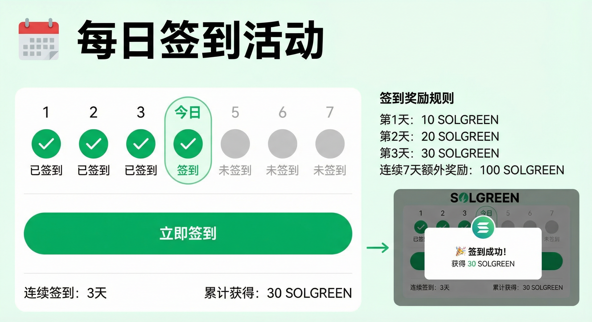

**详细操作流程：**

**步骤1：进入营销活动页面**
- 点击导航栏"营销活动"
- 找到"每日签到活动"卡片

**步骤2：查看签到日历**
- **签到日历**：显示7天的签到日历
- **已签到日期**：显示绿色对勾 ✓
- **未签到日期**：显示灰色圆圈 ○
- **今天日期**：高亮显示

**步骤3：查看奖励规则**
- **第1天**：10 SOLGREEN
- **第2天**：20 SOLGREEN
- **第3天**：30 SOLGREEN
- **连续7天**：额外奖励 100 SOLGREEN

**步骤4：执行签到**
- 点击"立即签到"按钮
- 系统记录签到时间
- 显示签到成功提示

**步骤5：查看签到统计**
- **连续签到天数**：3天
- **累计获得奖励**：30 SOLGREEN
- **下次签到奖励**：40 SOLGREEN

---

#### 13. 用户个人中心详情

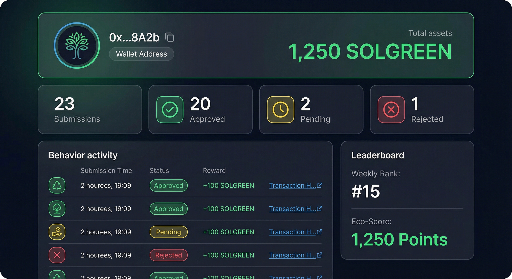

**详细功能说明：**

**资产信息区域：**
- **用户头像**：显示用户头像
- **钱包地址**：显示连接的钱包地址
- **总资产**：1,250 SOLGREEN

**统计卡片区域：**
- **总提交次数**：23次
- **已通过次数**：20次（87%通过率）
- **待审核**：2次
- **已拒绝**：1次

**行为记录列表：**
每条记录显示：
- **行为类型图标**：🗑️/🌳/🚴
- **提交时间**：2026-01-27 10:30
- **状态标签**：✅ 已通过 / ⏳ 待审核 / ❌ 已拒绝
- **奖励金额**：100 SOLGREEN
- **交易哈希链接**：点击查看链上交易

**排行榜信息：**
- **本周排名**：第15名
- **环保贡献值**：1,250分
- **查看完整排行榜**：点击查看所有排名

**操作功能：**
- 📊 查看详细统计图表
- 📤 分享环保贡献
- 🔄 刷新数据

---

### 第四部分：技术特性展示

#### 14. AI反欺诈检测流程

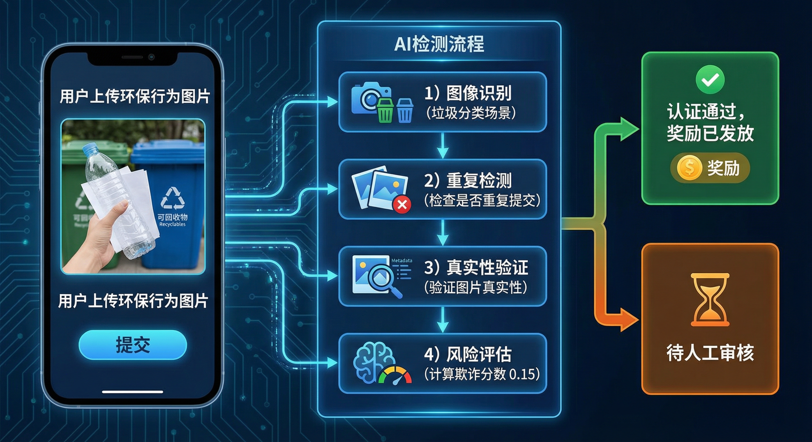

**检测流程详解：**

**步骤1：图像识别**
- 识别图片中的环保行为场景
- 验证图片内容与行为类型匹配度
- 检测图片质量和清晰度

**步骤2：重复检测**
- 检查是否重复提交相同内容
- 对比历史提交记录
- 防止恶意刷奖励行为

**步骤3：真实性验证**
- 检测图片是否经过PS处理
- 验证图片拍摄时间和地点
- 分析图片元数据

**步骤4：风险评估**
- 综合评分计算欺诈分数
- **分数 < 0.3**：低风险，自动通过 ✅
- **分数 0.3-0.7**：中风险，人工审核 ⏳
- **分数 > 0.7**：高风险，直接拒绝 ❌

**技术特点：**
- 🤖 集成百度AI、阿里云、AWS、Google Cloud等领先AI检测技术
- 📊 多维度综合评估
- ⚡ 实时检测，秒级响应
- 🔒 保护用户隐私和数据安全

---

#### 15. 区块链交易详情

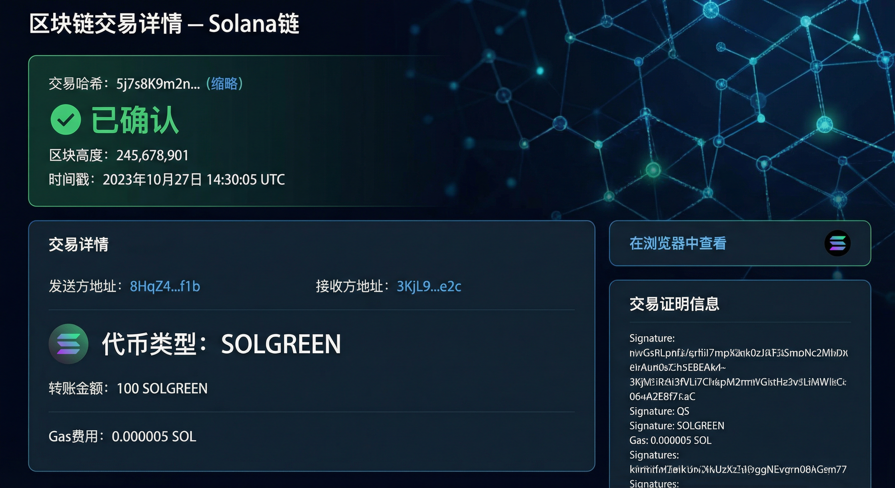

**链上记录说明：**

**交易基本信息：**
- **交易哈希**：5j7s8K9m2n...（唯一标识）
- **交易状态**：✅ 已确认
- **区块高度**：245,678,901
- **时间戳**：2026-01-27 10:30:25 UTC

**交易详情：**
- **发送方地址**：用户钱包地址
- **接收方地址**：奖励池地址
- **代币类型**：SOLGREEN（SPL Token）
- **转账金额**：100 SOLGREEN
- **Gas费用**：0.000005 SOL

**链上证明：**
- **存证哈希**：行为记录的哈希值
- **交易证明**：可在Solana Explorer查看完整交易
- **不可篡改**：所有记录永久保存在区块链上

**操作功能：**
- 🔗 在浏览器中查看：点击链接跳转到Solana Explorer
- 📋 复制交易哈希：方便分享和查询
- 📊 查看交易历史：查看所有相关交易

**安全特性：**
- ✅ 不可篡改的记录
- ✅ 公开透明的交易
- ✅ 去中心化存储
- ✅ 可追溯的完整历史

---

#### 16. 第三方机构认证

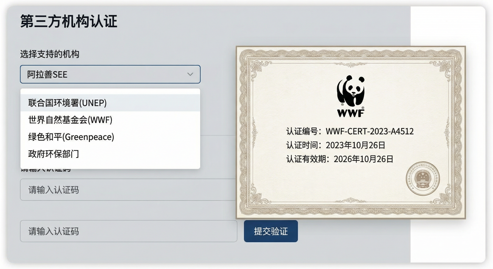

**认证流程详解：**

**步骤1：选择认证机构**
支持的认证机构：
- 🌿 **阿拉善SEE**：中国知名环保组织
- 🌍 **联合国环境署 (UNEP)**：国际权威环保机构
- 🐼 **世界自然基金会 (WWF)**：全球最大环保组织
- 🌱 **绿色和平 (Greenpeace)**：国际环保组织
- 🏛️ **政府环保部门**：官方认证机构

**步骤2：输入认证码**
- 从认证机构获取认证码
- 输入认证码到输入框
- 系统验证认证码有效性

**步骤3：提交验证**
- 点击"提交验证"按钮
- 系统向认证机构验证
- 等待验证结果

**步骤4：获得认证证书**
验证成功后显示：
- **认证机构Logo**：显示机构标识
- **认证编号**：唯一认证编号
- **认证时间**：获得认证的时间
- **认证有效期**：认证的有效期限

**认证优势：**
- ✅ 提高行为可信度
- ✅ 获得额外认证奖励（+50 SOLGREEN）
- ✅ 认证记录永久保存
- ✅ 提升用户信誉等级

---

#### 17. 移动端响应式界面

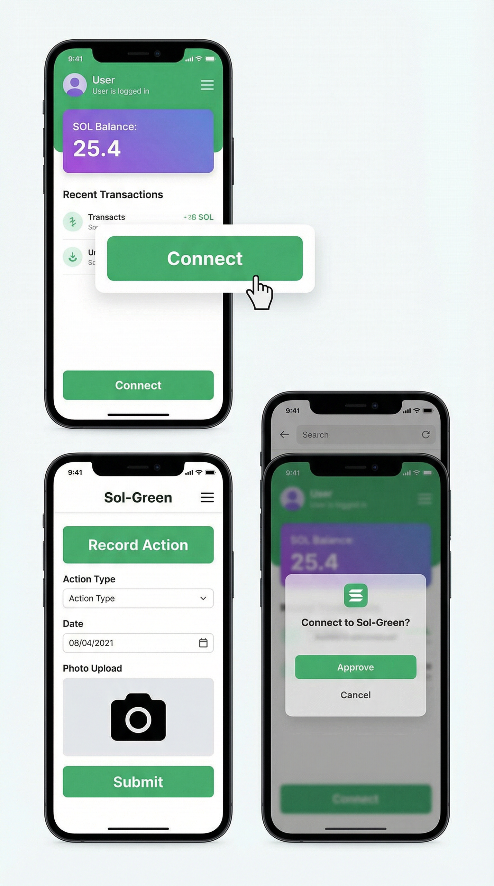

**移动端特性：**

**响应式设计：**
- 📱 完美适配手机和平板设备
- 🎨 优化的移动端UI设计
- 👆 触摸友好的操作体验
- 📐 自适应屏幕尺寸

**功能完整性：**
- ✅ 所有功能在移动端完整可用
- ✅ 钱包连接：支持移动端钱包应用
- ✅ 文件上传：优化的移动端上传体验
- ✅ 表单输入：便捷的移动端输入方式

**操作体验：**
- ⚡ 快速加载和响应
- 🎯 大按钮设计，易于点击
- 📸 相机直接拍照上传
- 🔔 推送通知提醒

**移动端钱包集成：**
- 支持Phantom移动端应用
- 支持Solflare移动端应用
- 一键连接，流畅体验

---

### 第五部分：完整操作流程

#### 18. 用户完整操作流程图

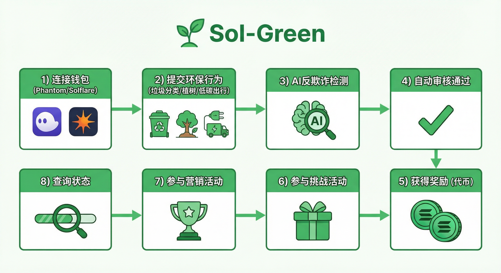

**完整使用流程：**

**阶段1：初始设置**
1. **访问平台** → 打开Sol-Green平台首页
2. **连接钱包** → 使用Phantom或Solflare钱包连接

**阶段2：提交行为**
3. **选择功能** → 点击"提交行为"进入提交页面
4. **填写信息** → 选择行为类型，填写地点，上传证明
5. **提交申报** → 点击提交按钮

**阶段3：审核流程**
6. **AI检测** → 系统自动进行反欺诈检测
7. **风险评估** → 计算欺诈分数
8. **自动审核** → 低风险行为自动通过

**阶段4：获得奖励**
9. **奖励发放** → 自动发放SOLGREEN代币奖励
10. **链上记录** → 行为记录上链，获得交易哈希

**阶段5：参与活动**
11. **参与挑战** → 使用已审核行为参与挑战活动
12. **营销活动** → 参与各类营销活动获得额外奖励

**阶段6：查询管理**
13. **查询状态** → 随时查询提交记录的状态
14. **查看资产** → 在个人中心查看资产和统计

---

## 🛠️ 技术栈

### 后端技术
- **语言**：Go 1.21+
- **框架**：Gin Web Framework
- **数据库**：PostgreSQL / SQLite
- **缓存**：Redis
- **认证**：JWT
- **区块链**：Solana Go SDK

### 智能合约
- **语言**：Rust
- **框架**：Anchor Framework
- **链**：Solana
- **代币**：SPL Token

### 前端技术
- **框架**：React 18
- **钱包**：Solana Wallet Adapter
- **HTTP客户端**：Axios
- **路由**：React Router
- **样式**：CSS3

### AI 检测
- 百度AI内容审核
- 阿里云内容安全
- AWS Rekognition
- Google Cloud Vision API

---

## 🚀 快速开始

### 环境要求
- Go 1.21+
- Node.js 18+
- Docker & Docker Compose（推荐）
- Solana CLI
- Anchor CLI

### 启动步骤

1. **克隆项目**
```bash
git clone <repository-url>
cd Solana-bootcamp-2026-s1-finalProject
```

2. **配置环境变量**
```bash
cp .env.example .env
# 编辑 .env 文件配置必要参数
```

3. **启动后端服务**
```bash
docker-compose up -d
# 或本地运行
cd backend
go run main.go
```

4. **启动前端应用**
```bash
cd frontend
npm install
npm start
```

5. **访问应用**
- 前端：http://localhost:3000
- 后端API：http://localhost:8080

详细配置说明请参考：[配置指南](./docs/CONFIG_SETUP_GUIDE_v3.0.0_CN.md)

---

## 📚 文档

- [快速开始指南](./docs/QUICKSTART_v3.0.0_CN.md)
- [API 文档](./docs/API_v3.0.0_CN.md)
- [部署文档](./docs/DEPLOYMENT_v3.0.0_CN.md)
- [技术文档](./docs/TECHNICAL_v3.0.0_CN.md)
- [功能演示](./docs/FEATURE_DEMONSTRATION.md)

---

## ✨ 核心特性

1. **去中心化**：基于 Solana 区块链，数据不可篡改
2. **智能审核**：AI 自动检测，提高审核效率
3. **即时奖励**：低风险行为自动通过，即时发放奖励
4. **活动丰富**：挑战活动和营销活动增加参与度
5. **多链支持**：支持多条区块链，未来可扩展
6. **第三方认证**：支持权威机构认证，提高可信度
7. **移动端支持**：完美适配移动设备
8. **安全可靠**：多重安全机制，保护用户资产

---

## 🤝 贡献

欢迎提交 Issue 和 Pull Request！

---

## 📄 许可证

MIT License

---

## 📞 联系方式

如有问题，请提交 Issue 或联系项目维护者。

---

**版本**: v3.0.0  
**更新日期**: 2026-01-27
