# 📸 项目图片快速预览

本文档用于快速预览所有功能展示图片，验证图片路径是否正确。

## 中文版图片 (Chinese Version)

### 基础功能展示

#### 1. 平台首页

#### 2. 钱包连接

#### 3. 提交环保行为

#### 4. 挑战活动列表

#### 5. 创建挑战

#### 6. 营销活动

#### 7. 查询行为状态

#### 8. 完整操作流程

### 详细功能展示

#### 9. 垃圾分类详情

#### 10. 植树造林详情

#### 11. 低碳出行详情

#### 12. 挑战活动详情

#### 13. 每日签到活动

#### 14. 用户个人中心

#### 15. AI反欺诈检测

#### 16. 区块链交易

#### 17. 第三方认证

#### 18. 移动端界面

---

## English Version Images

### Basic Features

#### 1. Platform Homepage
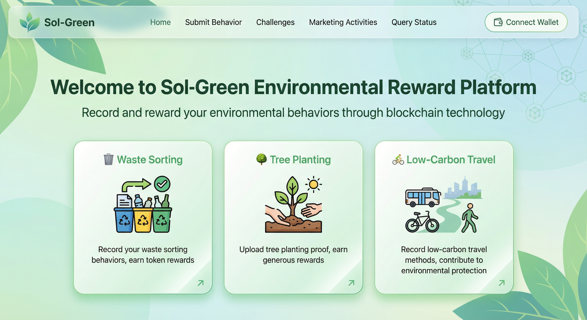

#### 2. Wallet Connection
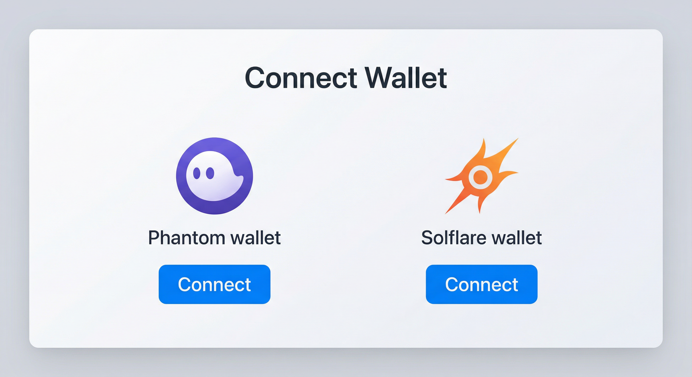

#### 3. Submit Environmental Behavior
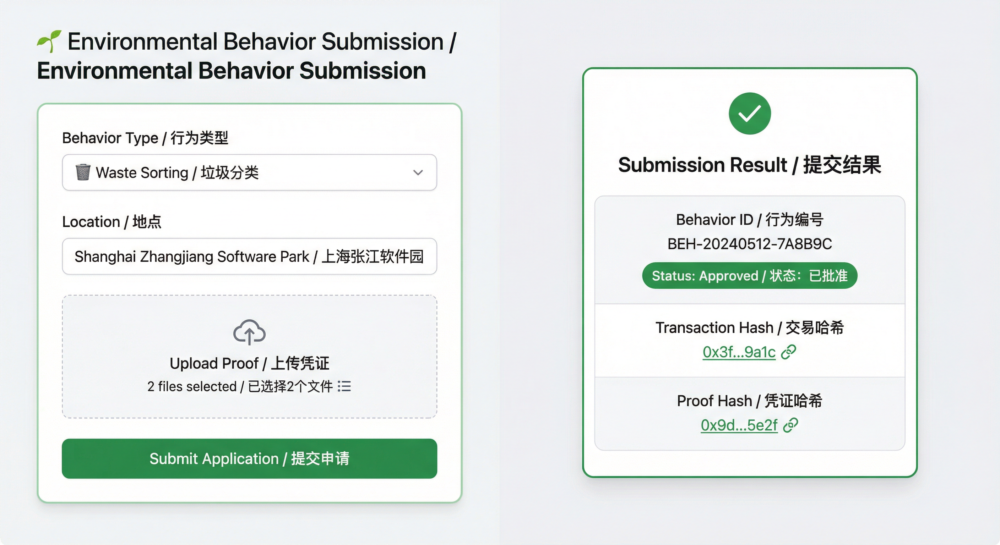

#### 4. Challenge Activities List
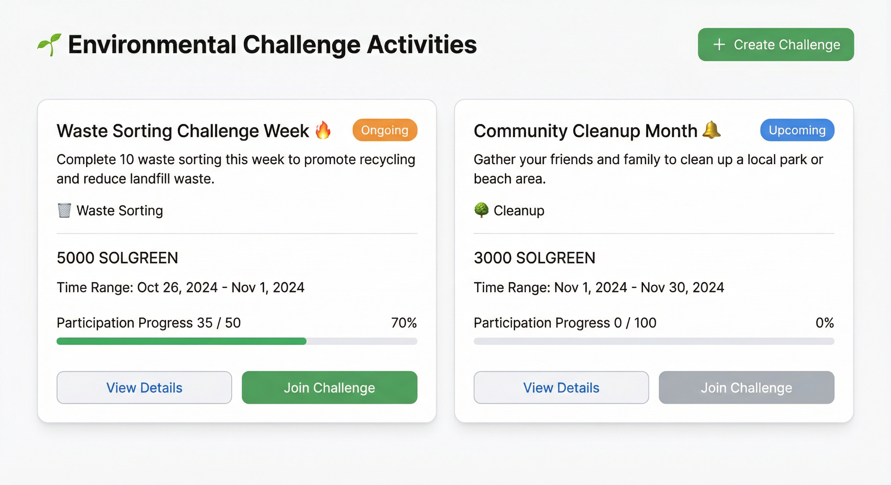

#### 5. Create Challenge
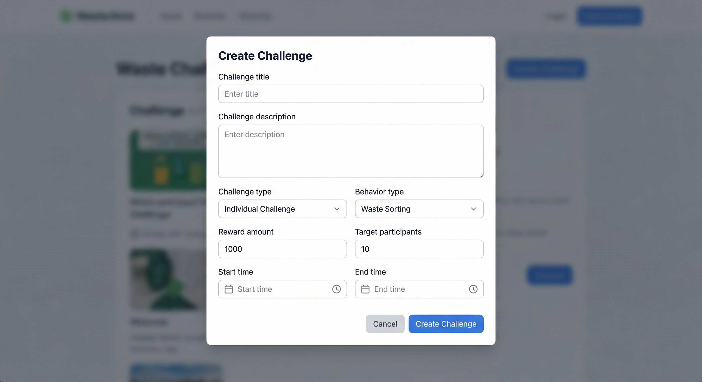

#### 6. Marketing Activities
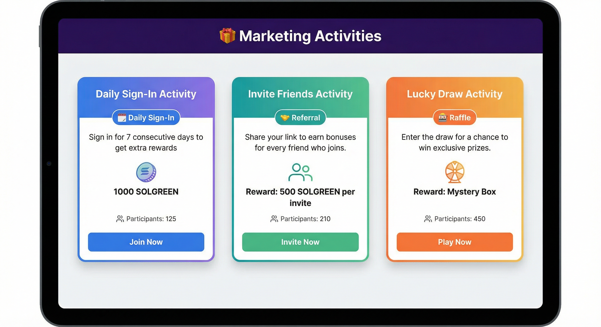

#### 7. Query Behavior Status
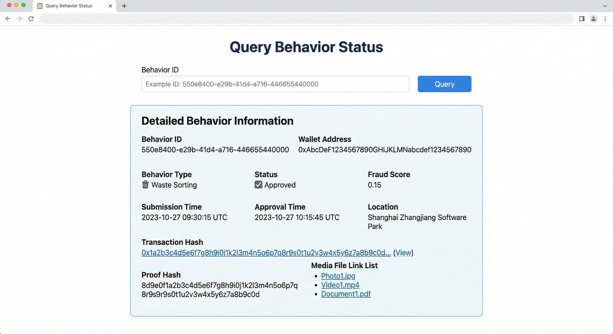

#### 8. Complete Operation Flow
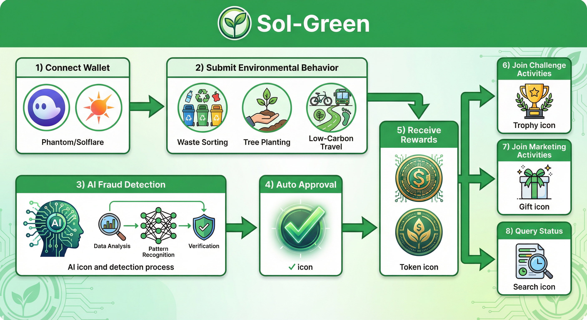

### Detailed Features

#### 9. Waste Sorting Details
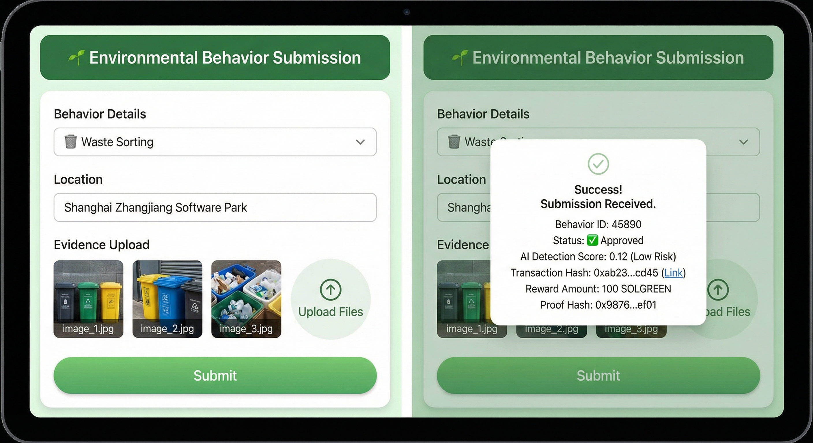

#### 10. Tree Planting Details
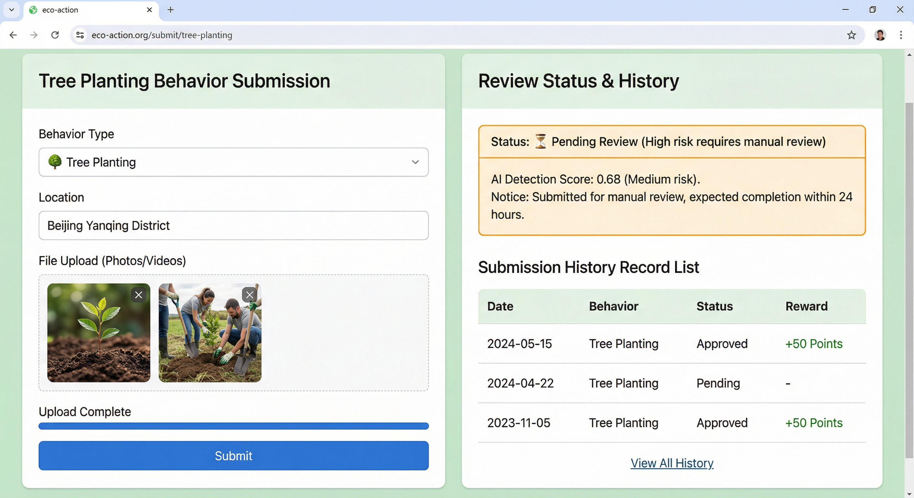

#### 11. Low-Carbon Travel Details
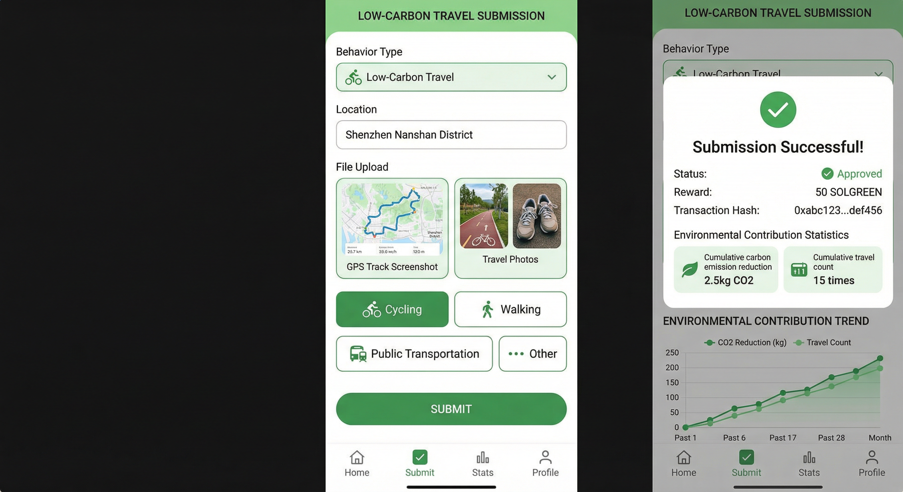

#### 12. Challenge Activity Details
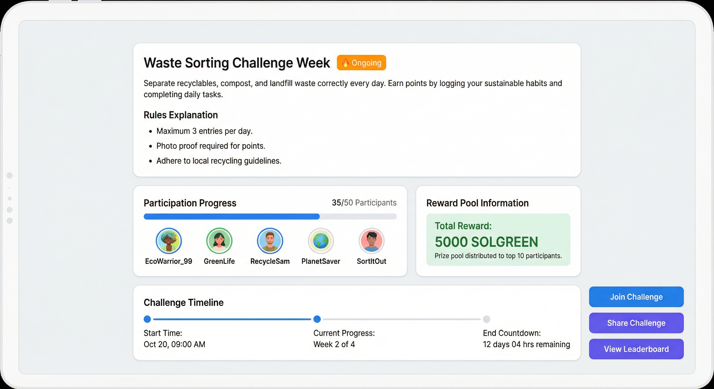

#### 13. Daily Sign-In Activity
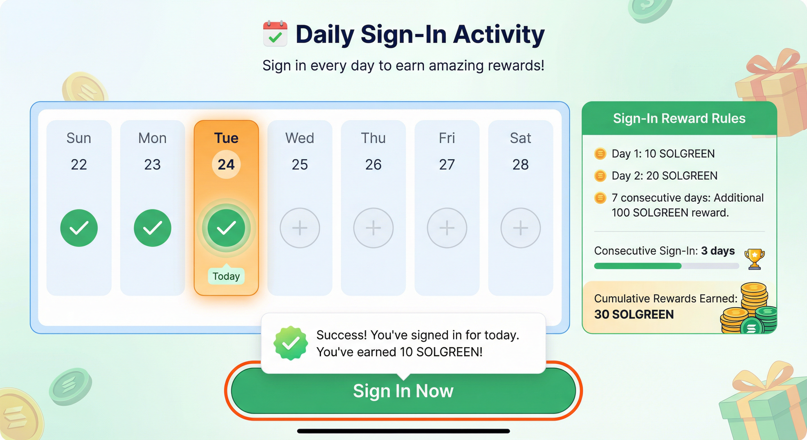

#### 14. User Dashboard
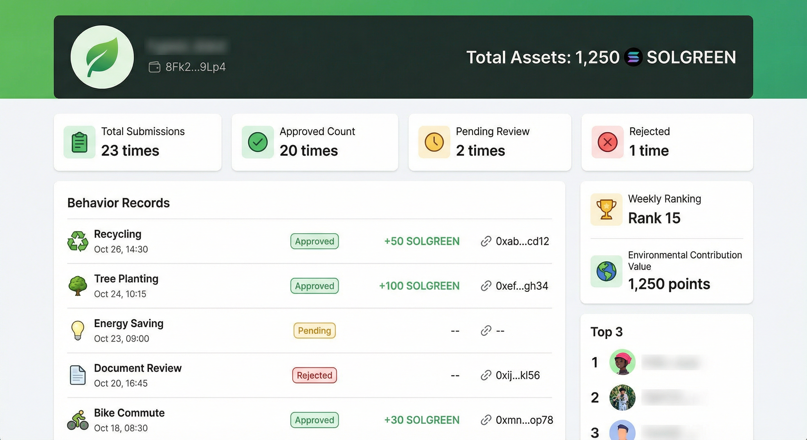

#### 15. AI Fraud Detection
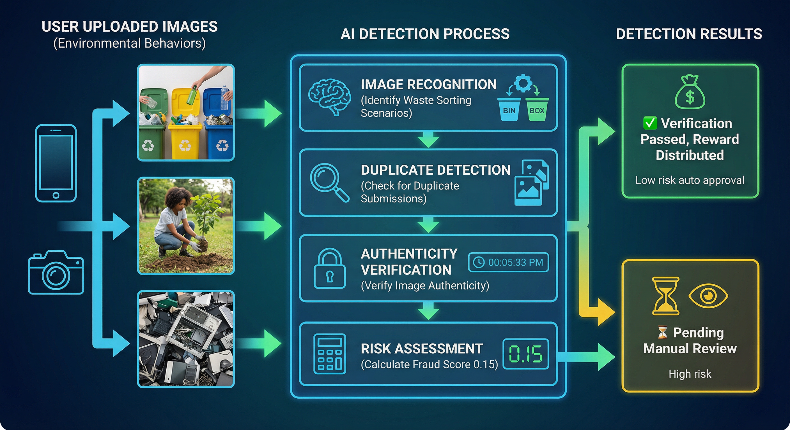

#### 16. Blockchain Transaction
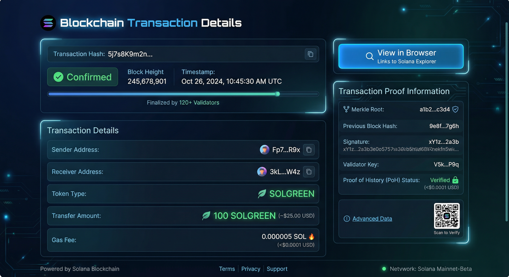

#### 17. Third-Party Verification
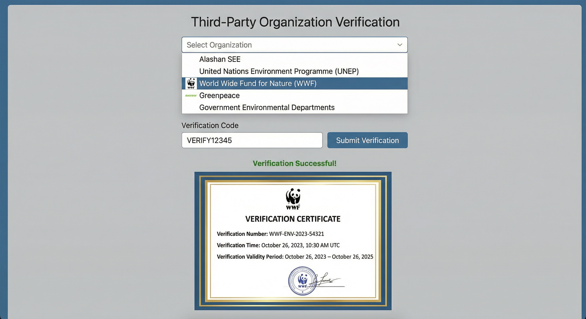

#### 18. Mobile Responsive Interface
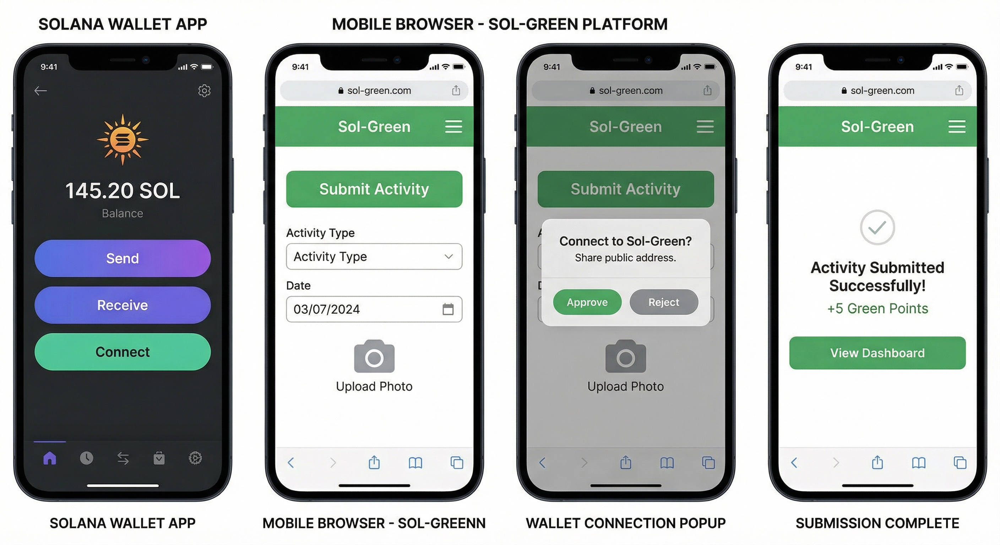

---

**说明 / Note**：
- 中文版图片用于中文文档 / Chinese version images are used in Chinese documents
- 英文版图片用于英文文档 / English version images are used in English documents
- 如果以上图片都能正常显示，说明图片路径配置正确 / If all images above display correctly, the image paths are configured correctly

**查看详细说明 / View Detailed Documentation**：
- [中文版项目介绍](./PROJECT_INTRO_CN.md)
- [English Project Introduction](./PROJECT_INTRO_EN.md)
